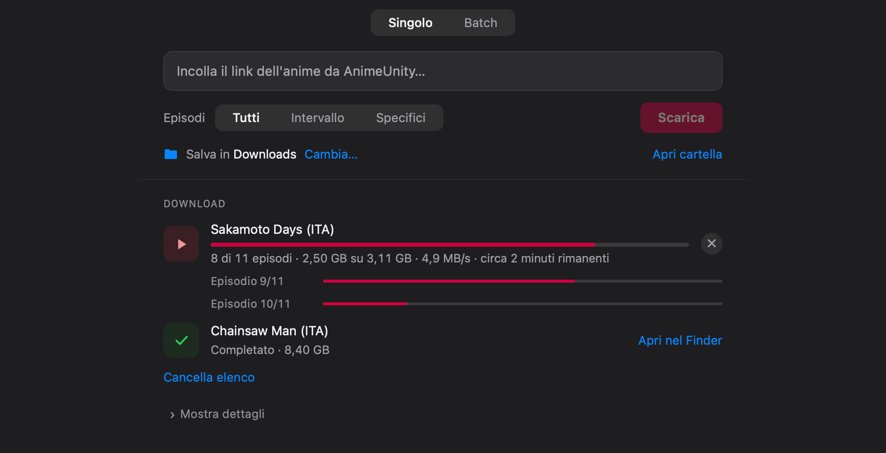
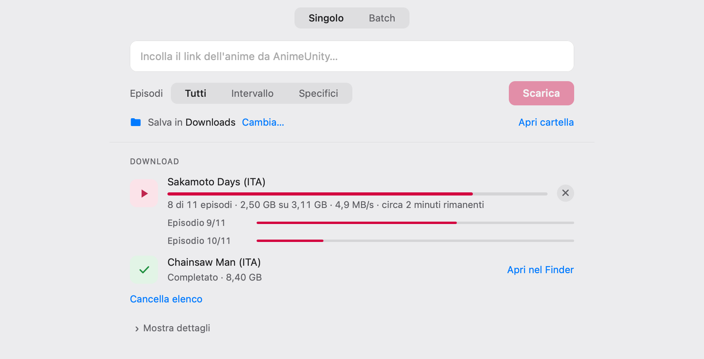

# AnimeUnity Downloader per macOS

> App con interfaccia grafica in stile Apple per scaricare anime da AnimeUnity.
> **Pronta all'uso**: niente da installare, niente terminale.



## ⬇️ Scarica l'app

1. Vai alla pagina **[Releases](../../releases/latest)** e scarica **`AnimeUnity-Downloader.dmg`**
2. Apri il file scaricato e **trascina l'app nella cartella Applicazioni**
3. Apri l'app da Applicazioni (o dal Launchpad)

> Al **primo avvio**, se macOS mostra *"impossibile verificare lo sviluppatore"*,
> fai **clic destro sull'app → Apri → Apri**. Serve solo la prima volta.

**Non devi installare Python né altro**: l'app contiene già tutto il necessario.

**Requisiti:** un Mac con chip Apple (M1, M2, M3… — tutti i Mac dal 2020 in poi).

## Funzionalità

- **Download singoli e in batch** — un anime alla volta o una lista di più anime
- **Scelta degli episodi** — tutti, un intervallo (es. dal 5 al 10) o episodi specifici
- **Avanzamento in tempo reale** — velocità, dati scaricati e tempo rimanente
- **Ripresa automatica** — se cade la connessione, riprende da dove si era interrotto
- **Salta i doppioni** — gli episodi già scaricati non vengono ripresi
- **Integrazione con macOS** — notifica a fine download, indicatore nella barra dei menu, tema chiaro/scuro automatico
- **Cartella personalizzabile** — decidi tu dove salvare i video

<p align="center">
  
  
</p>

---

<details>
<summary><b>Uso da riga di comando (avanzato, facoltativo)</b></summary>

Chi preferisce non usare l'app grafica può usare gli script Python originali.
Richiede Python 3 e le dipendenze del progetto:

```bash
pip install -r requirements.txt
```

Scaricare un anime (tutti gli episodi, un intervallo o una lista):

```bash
python3 anime_downloader.py <url_anime>
python3 anime_downloader.py <url_anime> --start 5 --end 10
python3 anime_downloader.py <url_anime> --episodes 3,7,12
```

Download in batch: inserire un URL per riga in `URLs.txt`, poi:

```bash
python3 main.py
```

Cartella di destinazione personalizzata: aggiungere `--custom-path <percorso>`.

</details>

<details>
<summary><b>Sviluppo e compilazione</b></summary>

L'interfaccia è servita da un piccolo server locale (`gui.py` + `gui_page.html`)
e mostrata in una finestra nativa `WKWebView` (`macos_app/main.swift`).

- **Ricompilare l'app di sviluppo:** `macos_app/build.sh`
- **Generare il pacchetto autosufficiente + DMG:** `macos_app/make_dist.sh`
  (scarica un Python portatile e incorpora tutto nell'app; solo Apple Silicon)

</details>

## Crediti e licenza

L'app grafica e l'impacchettamento per macOS sono un'estensione costruita sul
progetto originale a riga di comando di
**[Lysagxra/AnimeUnityDownloader](https://github.com/Lysagxra/AnimeUnityDownloader)**.

Distribuito sotto licenza **GPL-3.0**, la stessa del progetto originale.
