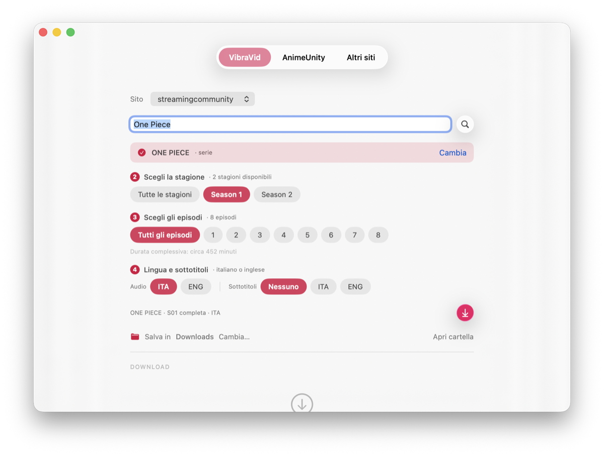
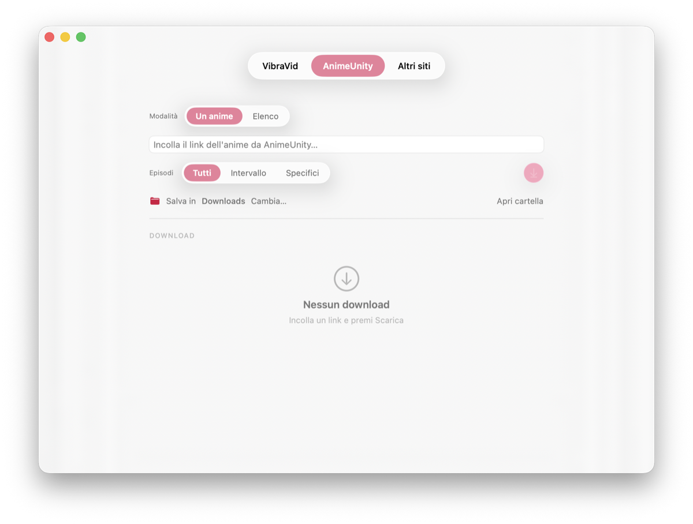

# Vault

> App per macOS che scarica film, serie e anime da 18 siti — e li guarda in
> streaming senza scaricare niente.
> **Pronta all'uso**: nessun Python da installare, nessun terminale.



## ⬇️ Scarica l'app

1. Vai alla pagina **[Releases](../../releases/latest)** e scarica il DMG
2. Aprilo e **trascina Vault nella cartella Applicazioni**
3. Avviala da Applicazioni o dal Launchpad

> Al **primo avvio**, se macOS dice *"impossibile verificare lo sviluppatore"*,
> fai **clic destro sull'app → Apri → Apri**. Serve solo la prima volta.

Dentro c'è già tutto il necessario: **non devi installare Python** né altro.

**Requisiti:** macOS 26 e un Mac con chip Apple.

## Cosa fa

Tre motori nella stessa finestra, uno per scheda.

### VibraVid — film, serie e anime da 18 siti

La ricerca è dentro l'app: nessun link da incollare. Scegli il titolo, poi
stagione ed episodi, e scarichi.

- **18 siti**, fra cui StreamingCommunity, AnimeWorld, AltaDefinizione, RaiPlay,
  Mediaset Infinity, Crunchyroll, Discovery+, Pluto TV, Tubi
- **Stagioni ed episodi** — tutta la serie, una stagione, o solo quelli che scegli
- **Audio e sottotitoli** in italiano o inglese
- **Durata complessiva** calcolata prima di cominciare
- I film saltano direttamente al download: non hanno stagioni da leggere

### ▶︎ Guarda senza scaricare

Il pulsante ▶︎ risolve il flusso e lo apre in **[IINA](https://iina.io)**, senza
occupare un byte di disco. Il titolo compare leggibile nella finestra del
lettore, e i segmenti che non arrivano vengono richiesti di nuovo invece di
essere saltati, così la riproduzione non fa salti in avanti.

Funziona sui siti che consegnano un flusso in chiaro. I 9 che lo consegnano
cifrato — Crunchyroll, RaiPlay, Mediaset Infinity, Discovery+ e i canali del
gruppo — restano solo scaricabili: un lettore esterno riceverebbe dati
illeggibili, quindi lì il pulsante non compare affatto.

### AnimeUnity — download singoli e in batch

Un anime alla volta oppure una lista intera, con scelta degli episodi: tutti, un
intervallo (dal 5 al 10) o quelli specifici che indichi.

<p align="center">
  
</p>

### Altri siti — yt-dlp

Per tutto il resto: incolli un link e yt-dlp fa il lavoro, con il pannello
completo delle sue opzioni a disposizione.

## In ogni scheda

- **Avanzamento in tempo reale** — velocità, dati scaricati, tempo rimanente
- **Coda dei download**, con quelli completati sotto
- **Ripresa automatica** se cade la connessione
- **Salta i doppioni**: quello che c'è già non viene riscaricato
- **Cartella a scelta**, con notifica a fine download
- **Tema chiaro e scuro** automatici, interfaccia nativa in Liquid Glass

---

<details>
<summary><b>Uso da riga di comando (avanzato, facoltativo)</b></summary>

Gli script Python originali di AnimeUnity restano utilizzabili da soli.
Richiedono Python 3 e le dipendenze del progetto:

```bash
pip install -r requirements.txt
```

Scaricare un anime (tutti gli episodi, un intervallo o una lista):

```bash
python3 anime_downloader.py <url_anime>
python3 anime_downloader.py <url_anime> --start 5 --end 10
python3 anime_downloader.py <url_anime> --episodes 3,7,12
```

Download in batch: un URL per riga in `URLs.txt`, poi:

```bash
python3 main.py
```

Cartella di destinazione personalizzata: aggiungere `--custom-path <percorso>`.

</details>

<details>
<summary><b>Sviluppo e compilazione</b></summary>

L'app è divisa in due pezzi: un'interfaccia nativa SwiftUI
(`macos_app/native/GlassApp.swift`) e un motore Python (`gui.py`) che gira come
piccolo server locale su `127.0.0.1:8765`. L'interfaccia non scarica nulla da
sola: parla col motore via API JSON.

- **Ricompilare e installare l'interfaccia:** `macos_app/native/build_native.sh`
- **Produrre il pacchetto autosufficiente e il DMG:** `macos_app/native/make_dist.sh`
  (incorpora un Python portatile, VibraVid, ffmpeg e yt-dlp; solo Apple Silicon)

Serve macOS 26 e i Command Line Tools; Xcode non è necessario.

</details>

## Crediti e licenza

Vault mette insieme il lavoro di altri, e va detto chiaramente:

- Il downloader AnimeUnity a riga di comando è di
  **[Lysagxra/AnimeUnityDownloader](https://github.com/Lysagxra/AnimeUnityDownloader)**
- La ricerca multi-sito e la risoluzione dei flussi sono di
  **[AstraeLabs/VibraVid](https://github.com/AstraeLabs/VibraVid)**, incluso nel pacchetto
- Il lettore consigliato per la riproduzione diretta è **[IINA](https://iina.io)**

L'interfaccia nativa per macOS, l'integrazione fra i tre motori e
l'impacchettamento sono l'aggiunta di questo progetto.

Distribuito sotto licenza **GPL-3.0**, la stessa dei progetti da cui deriva.
